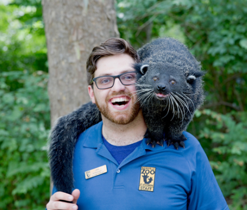
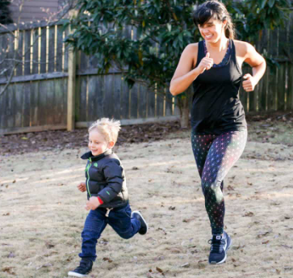

##  User Stories

#### Glenn
 src="glenn.png" alt="Glenn" width="200"/>

>As a Teacher who wants to make studies and learning fun and more Interesting for kids, I want to setup a scavnger hunt for students to explore new things on a science trip, and have a competitive game between student, to see which student is  finding more item and getting to know them, and how long does it take for them to complete there tasks.

******
#### Gopnik

>As a youth group leader, I always have the challenge of finding fun and interesting ways to keep my youth participants engaged. I want a way to organize activities that can be fun and spontaneous so we're not doing the same things all the time. I think this app would be a great way for my youth group to find new adventures by exploring our surroundings with technology.

*****
#### Lysander

>I am a Zoo Guest Engagement Manager, so I'm always looking for ways to make the zoo experience more interesting. I need activities that connect guests to online media about our exhibits and make their experience more than just a walk. This will make them more excited about coming to the zoo, and give us a more modern image.

*****
#### Margharitte

>As a mom who struggles to have her boy detach from his video games, I often look for new ways to keep him active. I need an activity that would interest him enough to explore outside and be socially active with technology. This would help tremendously as he would have fun and still have a way to stay connected.
